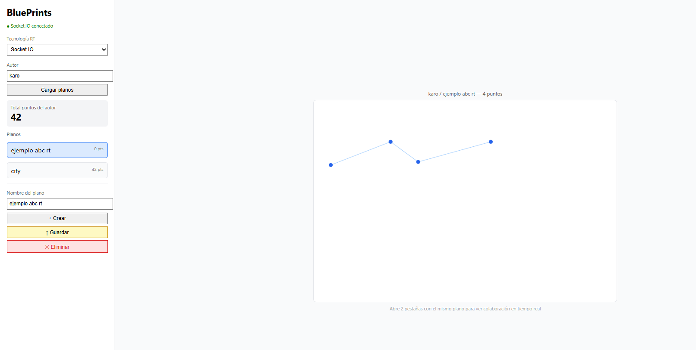

# BluePrints — Colaboración en Tiempo Real

## Integrantes
<!-- Agrega los nombres de tu equipo aquí -->

---

## Setup — Cómo correr el proyecto

Se necesitan **3 terminales abiertas simultáneamente**:

### 1. Backend CRUD (Spring Boot)
```bash
cd BluePrints_API
./mvnw spring-boot:run
# corre en http://localhost:8081
```

### 2. Backend Tiempo Real (Socket.IO)
```bash
cd example-backend-socketio-node-
npm install
npm run dev
# corre en http://localhost:3001
```

### 3. Frontend (React + Vite)
```bash
cd blueprints-front
npm install
npm run dev
# corre en http://localhost:5174
```

---

## Variables de entorno del Frontend

Archivo `.env.local` en la raíz de `blueprints-front`:

```
VITE_API_BASE=http://localhost:8081
VITE_IO_BASE=http://localhost:3001
```

---

## Endpoints CRUD usados

| Método | URL | Descripción |
|--------|-----|-------------|
| GET | `/blueprints/:author` | Lista todos los planos de un autor |
| GET | `/blueprints/:author/:name` | Obtiene los puntos de un plano |
| POST | `/blueprints` | Crea un nuevo plano |
| PUT | `/blueprints/:author/:name/points` | Agrega un punto al plano |
| DELETE | `/blueprints/:author/:name` | Elimina un plano |

---

## Decisiones de implementación

### 1. Prefijo `/blueprints` en lugar de `/api/blueprints`

El enunciado sugiere el prefijo `/api/blueprints`, sin embargo la API CRUD de la Parte 3 ya estaba construida
y en uso con el prefijo `/blueprints`. Cambiar el prefijo habría requerido modificar todos los endpoints existentes, los tests de integración y la documentación Swagger ya generada. Para evitar romper
funcionalidad, se mantuvo el prefijo original y se ajustó el frontend para consumir `/blueprints` directamente.

### 2. PUT punto por punto en lugar de reemplazar todos los puntos

El enunciado sugiere un `PUT /blueprints/:author/:name` que reemplace la lista completa de puntos. 
Nuestra API de la Parte 3 implementa el patrón de **adición incremental** (`PUT /blueprints/:author/:name/points`), que agrega un punto a la vez.
Este diseño es más consistente con el modelo de colaboración en tiempo real donde cada clic genera un punto nuevo,
y evita condiciones de carrera donde dos clientes podrían sobrescribirse mutuamente si ambos envían la lista completa al mismo
tiempo. El frontend los envía secuencialmente al guardar.

### 3. Tecnología RT elegida: Socket.IO

Se eligió **Socket.IO** sobre STOMP por las siguientes razones:

- El modelo de **rooms** es intuitivo para el caso de uso: cada plano es una sala `blueprints.{author}.{name}` y todos los clientes que abren ese plano se unen automáticamente.
- La integración con el frontend es mínima — un solo archivo `socketIoClient.js` con `createSocket()`.
- El servidor de referencia ya implementaba exactamente los eventos requeridos (`join-room`, `draw-event`, `blueprint-update`), lo que redujo el tiempo de integración.
- No requiere configuración adicional de broker o Spring WebSocket.

---

## Protocolo Socket.IO  a detalle

| Evento | Dirección | Payload |
|--------|-----------|---------|
| `join-room` | Cliente → Servidor | `"blueprints.{author}.{name}"` |
| `draw-event` | Cliente → Servidor | `{ room, author, name, point: {x, y} }` |
| `blueprint-update` | Servidor → Cliente | `{ author, name, points: [{x, y}] }` |

### Flujo completo
```
Clic en canvas
    │
    ▼
setPoints(prev => [...prev, point])   ← actualización local inmediata
    │
    ▼
socket.emit('draw-event', { room, author, name, point })
    │
    ▼
Servidor Socket.IO hace broadcast a todos en la sala
    │
    ▼
socket.on('blueprint-update', upd)    ← recibido en otras pestañas
setPoints(prev => [...prev, ...upd.points])
```

---

## Casos de prueba

| Caso | Cómo probarlo | Resultado esperado |
|------|---------------|--------------------|
| Estado inicial | Seleccionar un plano existente | Canvas carga los puntos guardados |
| Dibujo local | Clic en el canvas | Punto aparece inmediatamente |
| RT multi-pestaña | 2 pestañas con el mismo plano, dibujar en una | Punto aparece en la otra en tiempo real |
| Crear plano | Escribir nombre y presionar Crear | Aparece en la lista del autor |
| Guardar | Dibujar puntos y presionar Guardar | Puntos persisten al recargar |
| Eliminar | Seleccionar plano y presionar Eliminar | Desaparece de la lista |
| Total puntos | Cargar autor con varios planos | Muestra suma correcta con `reduce` |

A continuacióm se muestra una imagen de la interfaz :
